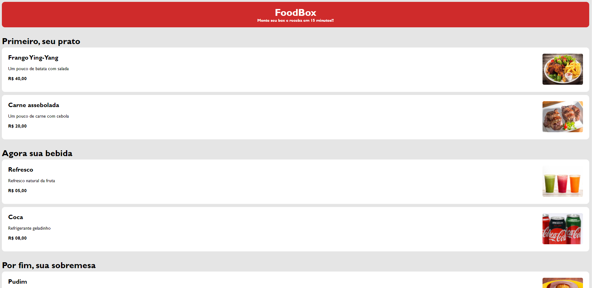

# FoodBox
<h1 align="center">FoodBox</h1>

Projeto realizado para adquirir mais conhecimento no desenvolvimento web.  

  <a href="#-tecnologias">Tecnologias</a>&nbsp;&nbsp;&nbsp;|&nbsp;&nbsp;&nbsp;
  <a href="#-projeto">Projeto</a>&nbsp;&nbsp;&nbsp;|&nbsp;&nbsp;&nbsp;
  <a href="#memo-licença">Licença</a>

  

 

  

## 🚀 Tecnologias

Esse projeto foi desenvolvido com as seguintes tecnologias:

- HTML e CSS
- Github
- Figma

## 💻 Projeto

Projeto feito com a idelização de ser um cardápio para realizar um pedido online.

- [Visite o projeto online]( https://helenapl145.github.io/FoodBox/)
## :memo: Licença

Esse projeto está sob a licença MIT.

---

Feito com ♥ by Helena Lima
